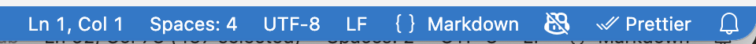
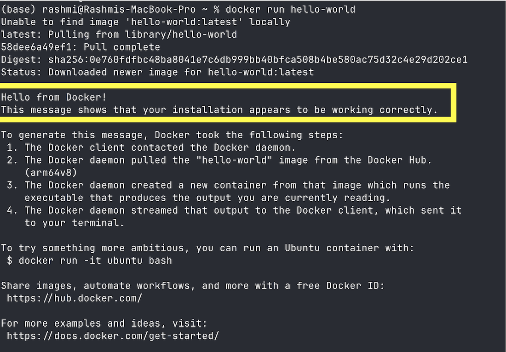

<!--
AUTHOR NOTES (remove before publishing, or keep - these are HTML comments and won't render):
- This is Tutorial 0, Part A. It is the prerequisite for every GCP tutorial.
- Part B (GCP Auth & Secrets) lives in `auth-and-secrets.md` and is linked just-in-time
  from the first tutorial that needs credentials - NOT here.
- 📸 markers show where to drop screenshots (save them in images/).
-->

# AC215 · Tutorial 0 - Setup & Installs

> **Start here.** This is the one-time setup you do **before any other tutorial**. Work through it
> top to bottom and tick the boxes as you go - it takes about **30-45 minutes**. You only do this once.

This guide assumes no prior Google Cloud experience and explains *what* each tool is and *why* we use it as we go.

> This is Part A of Tutorial 0. It covers the accounts and tools you need before the first hands-on tutorial.
> Part B covers GCP authentication and secrets. We will link to it later, the first time you actually need it.

---

## ✅ Setup checklist

By the end of this guide you'll have:

- [ ] A code editor (**VS Code**) with the right line-ending setting
- [ ] **Git** installed and a **GitHub** account
- [ ] **Docker Desktop** installed and verified
- [ ] **uv** (our Python tool) installed
- [ ] A **personal Google account** (for Colab + Google Cloud)
- [ ] A **Google Cloud Platform (GCP)** account with **credits**
- [ ] Your **first GCP project** created (and its Project ID written down)
- [ ] A **budget alert** set, so you never get surprised by costs

---

## Before you start: what we assume you know

This course is hands-on. You'll be most comfortable if you have:

- **Python** - functions, classes, lists/dicts, reading & writing files; some NumPy/Pandas.
- **A deep-learning framework** - basic TensorFlow *or* PyTorch.
- **The command line** - moving between folders and running commands in a terminal.
- **ML basics** - what a model is, roughly how training works.

You don't need to be an expert in all of these. If something is unfamiliar, lean on office hours and
the course channels - that's what they're for.

---

## 1. Install a code editor (VS Code)

An editor (IDE) is where you'll read and write code. We use **VS Code**; if you already love another
editor (Cursor, PyCharm, …), keep it.

- Download & install: <https://code.visualstudio.com/download> (Mac / Windows / Linux)

> **⚠️ Important - set line endings to `LF`.** Our tutorials run inside Linux containers, and Linux
> expects `LF` line endings. If your editor saves files with Windows-style `CRLF`, shell scripts like
> `docker-shell.sh` will fail with confusing errors. In VS Code:
> **Settings → Text Editor → Files → Eol →** choose **`\n`** (`LF`). You can also click the
> `CRLF`/`LF` indicator in the bottom-right status bar and switch it to `LF`.



*The line-endings indicator lives in VS Code's bottom status bar - here it shows **`LF`** (correct). Click it to toggle between `LF` and `CRLF`.*

---

## 2. Install Git + create a GitHub account

**Git** tracks versions of your code; **GitHub** hosts it online so you can collaborate and submit work.

- Install Git: <https://git-scm.com/downloads> (or GitHub Desktop: <https://desktop.github.com/>)
- Create a free GitHub account: <https://github.com/join> (you'll use **private** repos for your project)

**Verify it worked** - open a terminal and run:

```bash
git --version
```

You should see a version number (e.g. `git version 2.43.0`).

---

## 3. Install Docker Desktop

**Docker** lets us package an app together with everything it needs and run it the same way on any
machine. Most tutorials run inside Docker, so this one matters.

- Install Docker Desktop: <https://www.docker.com/products/docker-desktop/> (Mac / Windows / Linux)
- After installing, **launch Docker Desktop** and wait until its whale icon says it's running.

> **🪟 Windows note.** Docker Desktop needs **WSL2** (Windows Subsystem for Linux). The installer
> usually sets this up for you - accept the prompts and restart if asked. More detail:
> <https://docs.docker.com/desktop/setup/install/windows-install/>

**Verify it worked** - with Docker Desktop running, open a terminal and run:

```bash
docker run hello-world
```

You should see *"Hello from Docker!"*. If you do, Docker is working. 🎉



*Success looks like this: "Hello from Docker! This message shows that your installation appears to be working correctly."*

---

## 4. Install uv (our Python tool)

**uv** is a fast tool that creates isolated Python environments and installs packages. Every tutorial
uses it, so you don't have to fight with Python versions or `pip` by hand. uv can even install the
right version of Python for you.

**Mac / Linux:**

```bash
curl -LsSf https://astral.sh/uv/install.sh | sh
```

**Windows (PowerShell):**

```powershell
powershell -ExecutionPolicy ByPass -c "irm https://astral.sh/uv/install.ps1 | iex"
```

Close and reopen your terminal, then **verify**:

```bash
uv --version
```

More install options: <https://docs.astral.sh/uv/getting-started/installation/>

---

## 5. Create a Google account for Colab

Some tutorials use **Google Colab** - free Jupyter notebooks in the browser with optional free GPUs, no
setup required. Any Google account works.

- Try it: <https://colab.research.google.com/>

---

## 6. Set up Google Cloud Platform (GCP)

Google Cloud is where we'll run virtual machines, store data, and deploy apps. 

### 6a. Create your GCP account

- Go to <https://console.cloud.google.com/> and sign in with your Google account.
- Accept the terms when prompted.
- Create individual account not under "Harvard Organization" (or "Brown Organization")

### 6b. Get your credits

Cloud resources cost money, but you won't pay out of pocket - you'll use **credits**, and they arrive
in **two stages**:

**1. Right now - your $300 free trial.** New Google Cloud accounts get **$300 in free credit**
(Google's free trial, valid for ~90 days). This is what you use to get started and run the early
tutorials. Activate it at <https://cloud.google.com/free>.

> Google asks for a credit card to verify your identity, but **won't charge you** during the free
> trial - when the $300 (or the 90 days) runs out, your resources simply pause until you choose to
> upgrade. There's no risk of a surprise bill.

**2. After the add/drop deadline - course credits.** Once enrollment settles, the course gives
**additional $50 credits** to enrolled students. The staff will send instructions then.

<!-- 📸 SCREENSHOT: GCP billing / credits page -->

### 6c. Create your first project

A **project** is a container for everything you build on GCP - its VMs, storage, and settings live
inside it. Most tutorials assume you have one.

1. In the [Cloud Console](https://console.cloud.google.com/), click the **project dropdown** at the
   top of the page.
2. Click **New Project**.
3. Give it a name like `ac215` and click **Create**.
4. Once it's created, select it from the dropdown so it's your active project.

> **Write down your Project ID.** GCP gives every project a globally unique **Project ID** (often
> your name plus some numbers, e.g. `ac215-456789`). It is usually **not** the same as the name you
> typed, and **yours will not be "ac215"** - it's unique to you. Tutorials refer to this value as
> `GCP_PROJECT`, so keep it handy.

<!-- 📸 SCREENSHOT: GCP console - New Project dialog with Project ID highlighted -->

---

## 7. Cost hygiene (please read)

Credits are real money. A few habits will keep you from ever running out:

- **Set a budget alert.** In the Console, go to **Billing → Budgets & alerts → Create budget**, set a
  small amount (e.g. $25), and you'll get an email if you approach it. This is your safety net.
- **Delete what you're not using.** When a tutorial has you create a **VM**, **delete it when you're
  done** - a running VM keeps charging even while idle. The same goes for other resources you spin up.
- **Stop ≠ delete.** Stopping a VM pauses compute charges but you may still pay for its disk. If you're
  finished with it, delete it.

> Until the course credits arrive after the add/drop deadline, your **$300 free trial is all you
> have** - so build the delete-when-done habit from day one. You'll get plenty of reminders inside the
> tutorials, but this habit is the single best way to make your credits last all semester.

<!-- 📸 SCREENSHOT: GCP Budgets & alerts page -->

---

## 8. (Optional) Install the gcloud CLI

The **gcloud CLI** lets you control Google Cloud from your terminal. It's **not required** to start -
most early tutorials use the web console and the browser SSH button - but it's handy later.

- Install: <https://cloud.google.com/sdk/docs/install>
- Then sign in: `gcloud auth login`

---

## Getting the tutorial code

Each tutorial lives in its own repository under **<https://github.com/dlops-io>**. When a tutorial
tells you to, you'll clone it, for example:

```bash
git clone https://github.com/dlops-io/simple-translate.git
```

> **💡 Tip.** Keep all the tutorials together in one folder (e.g. `~/ac215/`) so they're easy to find.

---

## You're ready!

If every box at the top is checked, you've finished Tutorial 0, Part A.

**What's next:** head to your **first tutorial** (*Install an App on a GCP VM*). It uses everything
you just set up.

> **About credentials.** Some later tutorials need apps to access Google Cloud on your behalf.
> We’ll point you to **Tutorial 0, Part B - GCP Auth & Secrets** when you need it.

